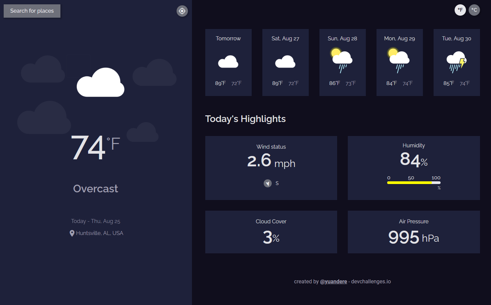
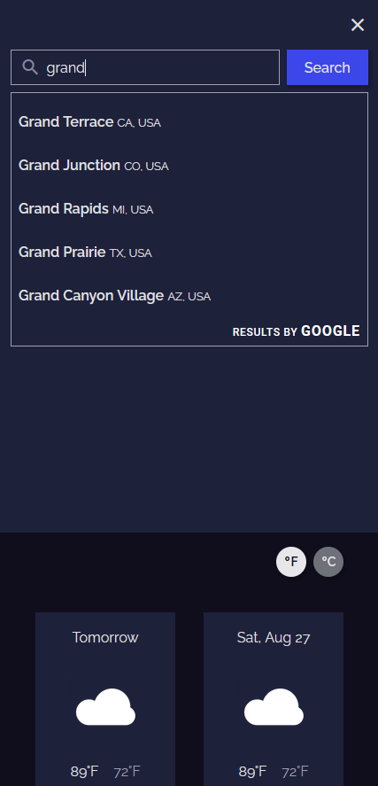

<!-- Please update value in the {}  -->

<h1 align="center">Simple Weather Forecast</h1>

<div align="center">
   Solution for a challenge from  <a href="http://devchallenges.io" target="_blank">Devchallenges.io</a>.
</div>

<div align="center">
  <h3>
    <a href="https://app.netlify.com/sites/papaya-gaufre-0fb8ec">
      Demo
    </a>
    <span> | </span>
    <a href="https://github.com/yuandere/weather-app">
      Solution
    </a>
    <span> | </span>
    <a href="https://devchallenges.io/challenges/mM1UIenRhK808W8qmLWv">
      Challenge
    </a>
  </h3>
</div>

<!-- OVERVIEW -->

## Overview

| Desktop/Tablet | Mobile |
| --- | --- |
|  |  |

This is a simple weather app that will give a 5-day forecast for your area or any chosen location, powered by Google Places API. You can also see current conditions for wind speed/direction, humidity, air pressure, and cloud cover.


### Built With

<!-- This section should list any major frameworks that you built your project using. Here are a few examples.-->

- [React](https://reactjs.org/)
- [Vite](https://vitejs.dev/)
- [Tachyons](http://tachyons.io/)
- [use-places-autocomplete](https://github.com/wellyshen/use-places-autocomplete)
- [react-cool-onclickoutside](https://github.com/wellyshen/react-cool-onclickoutside)

## Features

<!-- List the features of your application or follow the template. Don't share the figma file here :) -->

This application/site was created as a submission to a [DevChallenges](https://devchallenges.io/challenges) challenge. The [challenge](https://devchallenges.io/challenges/mM1UIenRhK808W8qmLWv) was to build an application to complete the given user stories.

## How To Use

<!-- Example: -->

To clone and run this application, you'll need [Git](https://git-scm.com) and [Node.js](https://nodejs.org/en/download/) (which comes with [npm](http://npmjs.com)) installed on your computer. From your command line:

```bash
# Clone this repository
$ git clone https://github.com/yuandere/weather-app

# Install dependencies
$ npm install

# Run the app
$ npm start
```

## Acknowledgements

<!-- This section should list any articles or add-ons/plugins that helps you to complete the project. This is optional but it will help you in the future. For example: -->

- [Custom breakpoint React Hook](https://dev.to/chilupa/usebreakpoint-react-hook-13oa)
- [Create CSS properties that dynamically update with React & JS](https://spacejelly.dev/posts/how-to-create-css-custom-properties-that-dynamically-update-with-react-javascript/)
- [Steps to replicate a design with only HTML and CSS](https://devchallenges-blogs.web.app/how-to-replicate-design/)

## Contact

- GitHub [@yuandere](https://github.com/yuandere)
- Discord [@al doub#7487](https://discord.com)
